# 網路行為研究：探討不同群體的網路使用與霸凌現象關聯

## 研究概述
本研究使用臺灣傳播調查資料庫（2021年）的調查數據，透過多變量分析方法探討不同群體的網路使用行為與霸凌傾向之關聯。研究對象涵蓋19-61歲族群（N=672），採用廣義關聯圖（GAP）、主成分分析（PCA）等統計方法進行分析。這項研究的重要性在於，隨著數位科技的快速發展，網路霸凌已成為一個需要嚴肅面對的社會議題。

## 研究背景與方法論基礎

### 資料來源與調查方法
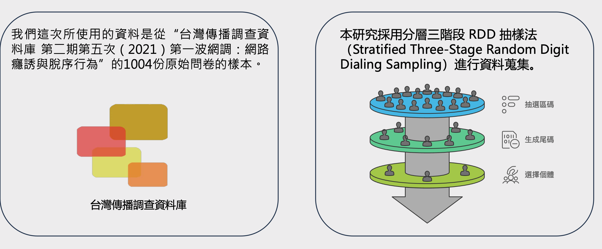

本研究的數據來源為「台灣傳播調查資料庫」的1004份樣本問卷，採用分層三階段RDD抽樣法進行資料蒐集。這種抽樣方法能確保樣本的代表性，並降低抽樣偏誤。如圖所示，抽樣過程分為三個關鍵階段，確保了資料的科學性和可靠性。

### 資料預處理流程
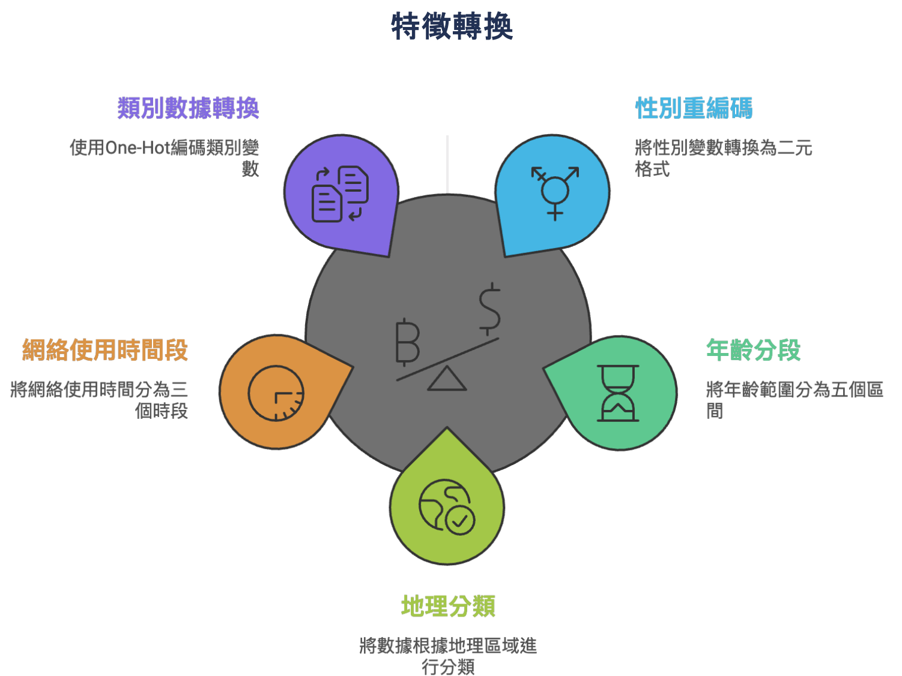

資料預處理階段包含五個重要步驟：類別數據轉換、性別重編碼、網路使用時間段劃分、年齡分組和地理分類。這個系統性的預處理過程確保了後續分析的準確性。特別是在處理網路使用時間數據時，我們採用了標準化的方法，將不同時間單位統一轉換為小時制。

## 樣本特徵分析

### 人口統計特徵

#### 出生年份分布
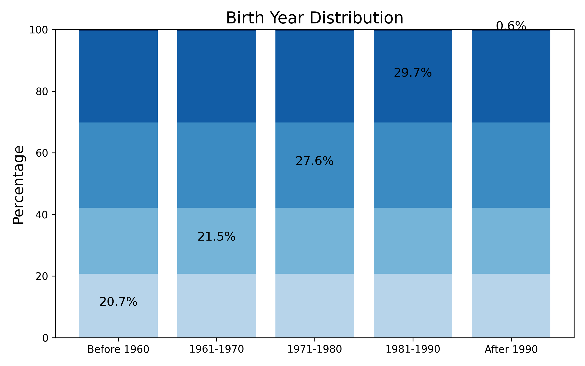

從出生年份分布圖可以看出，1981-1990年出生的群體占比最高（29.7%），其次是1971-1980年出生者（27.6%）。這種分布反映了我們的樣本主要集中在具有較強網路使用習慣的青壯年群體，同時也包含了足夠的中年和老年使用者，使研究結果具有更廣泛的代表性。

#### 性別分布
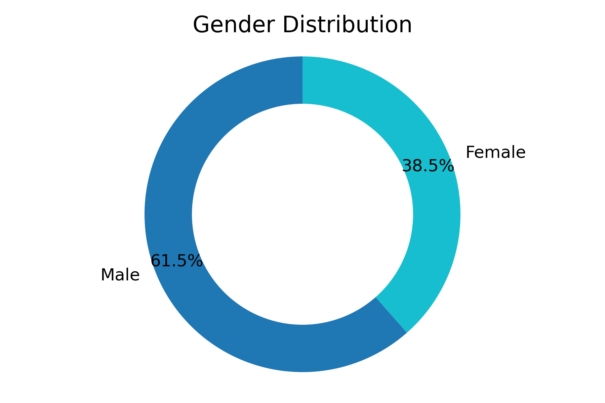

性別分布呈現出明顯的差異，男性占61.5%，女性占38.5%。這種性別分布的不均衡性值得注意，可能反映出網路使用行為的性別差異，也為後續分析提供了重要的參考維度。

#### 地理分布
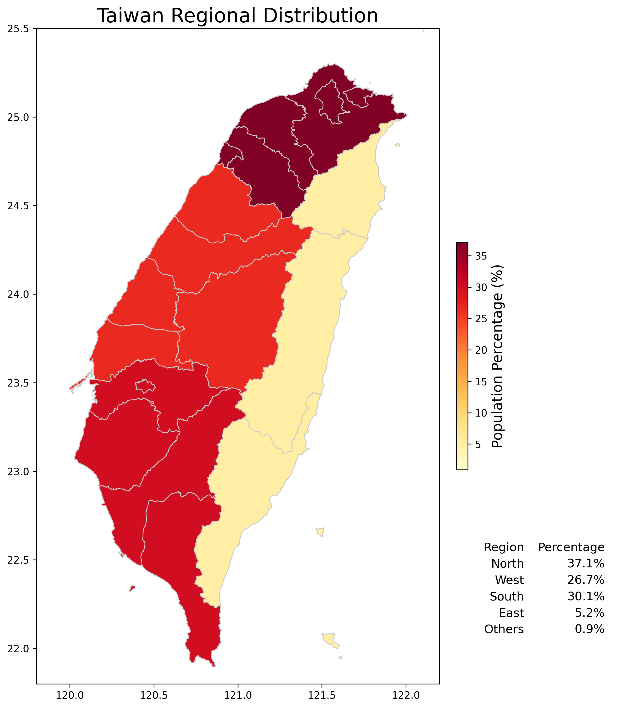

地理分布數據顯示，北部地區的使用者比例最高（37.1%），其次是南部（30.1%）和中部（26.7%）。這種分布大致符合台灣的人口分布特徵，但東部地區的樣本比例（5.2%）相對較低，這是研究限制之一。

### 網路使用行為分析

#### 使用時間分布
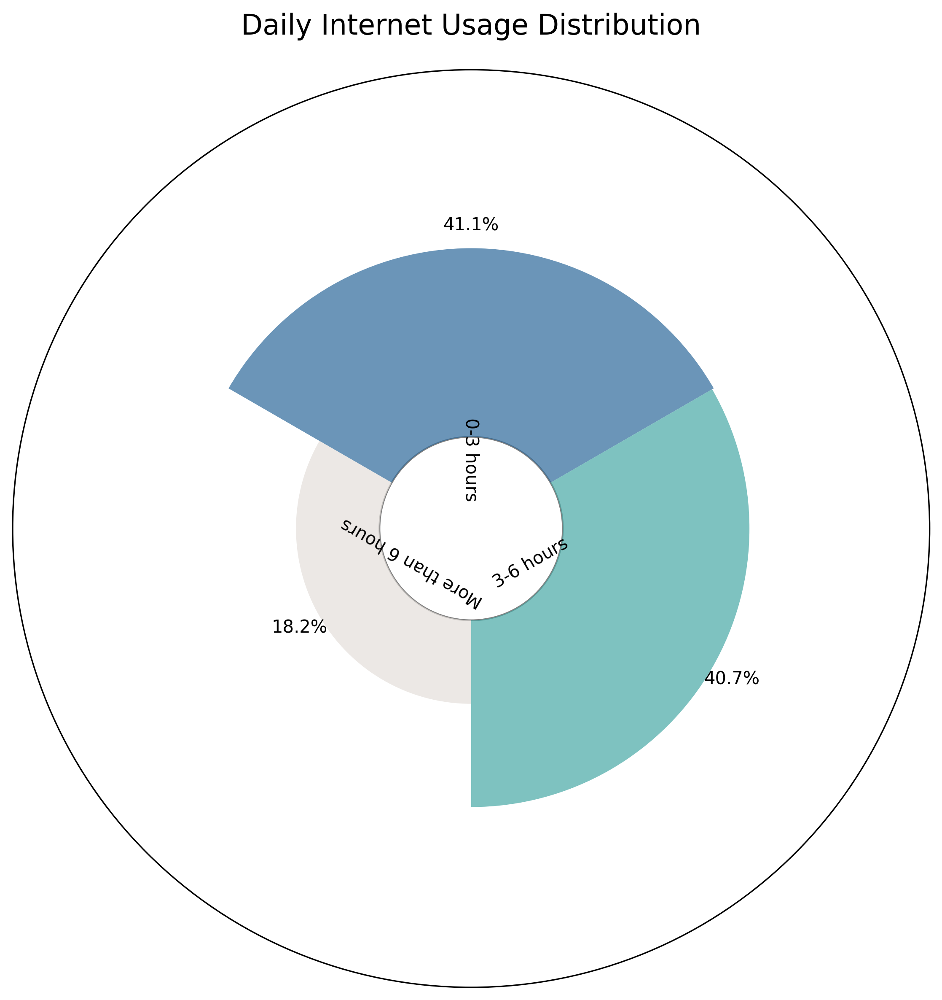

網路使用時間的分布呈現出有趣的模式：0-3小時和3-6小時的使用者比例相近（分別為41.1%和40.7%），顯示大多數使用者維持在中等使用強度。而6小時以上的高強度使用者占18.2%，這個群體在後續分析中展現出特殊的行為特徵。

## 多變量分析方法

### 研究方法框架
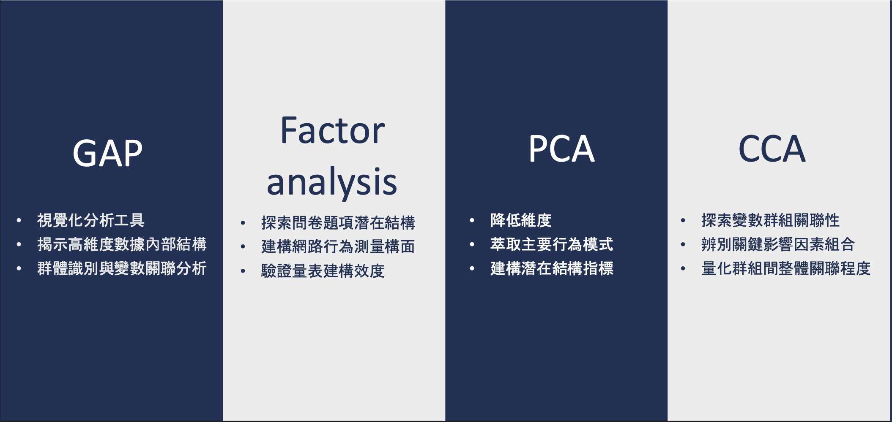

本研究採用了五種互補的多變量分析方法，形成了一個完整的分析鏈。從探索性的GAP分析開始，通過因素分析和主成分分析進行維度縮減，再使用典型相關分析探索變量群組間的關係，最後運用羅吉斯迴歸建立預測模型。

### 研究動機與社會意義
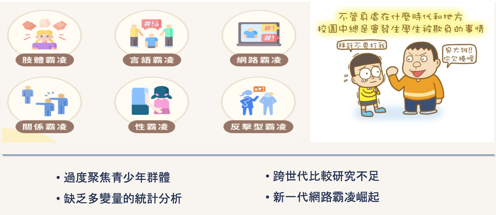

研究動機圖揭示了目前網路霸凌研究存在的主要問題：過度聚焦於青少年群體、缺乏多變量統計分析、跨世代比較研究不足。本研究試圖通過更全面的分析方法和更廣泛的研究對象來填補這些研究空白。

## 分析結果

### GAP分析發現
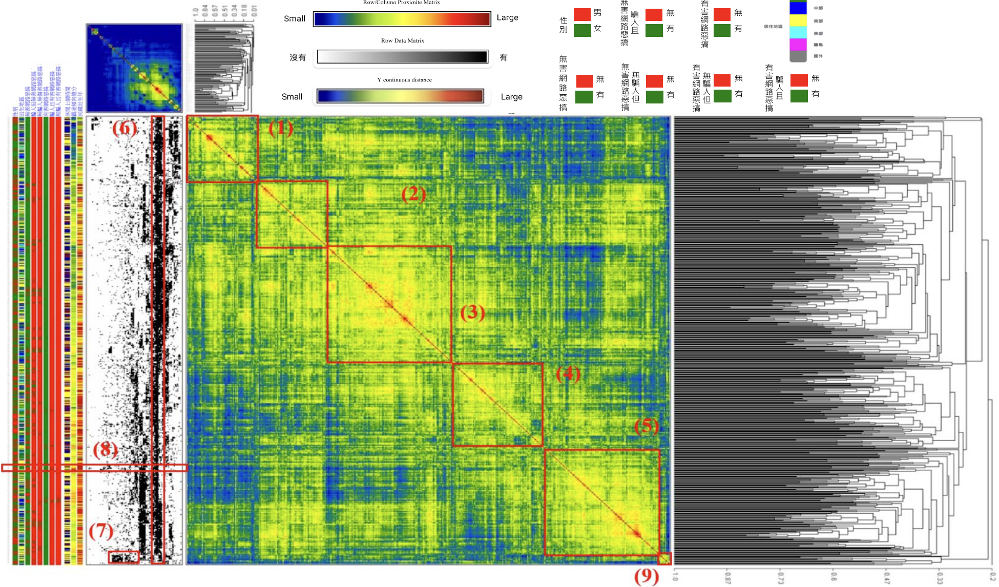

廣義關聯圖(GAP)分析揭示了網路使用者的五種典型群體特徵。透過二元GAP的視覺化結果，我們可以從熱圖的對角線分布清楚觀察到這五個群體的邊界特徵：每個群體內部呈現淺黃色的高相似性區塊，而群體之間則呈現較深的顏色，表明群體間存在明確的行為差異。

具體而言，這五個群體分別為：

1. 保守使用群：
   - 主要由中年男性組成
   - 網路使用時間維持在適中水平
   - 加權總分趨勢偏低（平均低於46.3分）
   - 地理分布集中在中北部地區
   - 展現出謹慎的網路使用行為模式，較少參與具爭議性的網路活動

2. 理性使用群：
   - 性別分布較為平均
   - 年齡層集中在青壯年階段
   - 網路使用時間相對較短
   - 在中部地區的分布比例較高
   - 展現出目的導向的使用行為，對網路互動採取理性克制的態度

3. 一般使用群：
   - 以青年族群為主
   - 性別分布平均
   - 每日上網時間呈現中高度使用特徵
   - 主要分布在中部地區
   - 網路行為模式相對中性，加權總分維持在平均水平

4. 高度參與群：
   - 主要由女性青年組成
   - 展現高頻率的網路使用特徵
   - 加權總分趨勢偏高
   - 集中分布在中北部地區
   - 在各類網路活動中表現活躍，但仍維持在可接受範圍內

5. 風險警示群：
   - 以女性青年為主
   - 擁有最高的網路使用時間
   - 加權總分明顯高於其他群體（顯著超過平均值46.3分）
   - 主要分布在中北部地區
   - 網路行為模式顯著偏離一般群體，需要特別關注

### 因素結構分析
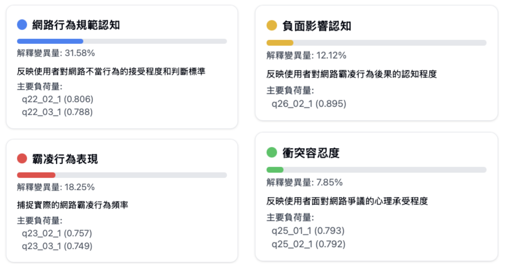

因素分析結果識別出四個具有明確理論意涵的主要因素，累積解釋變異量達69.79%。這些因素分別為：

1. 網路行為規範認知（解釋31.58%變異量）：
   - 主要由q22系列題項構成
   - 最高負荷來自q22_02_1（0.806）和q22_03_1（0.788）
   - 反映使用者對網路不當行為的接受程度和判斷標準
   - 在網路行為形成中扮演核心角色

2. 霸凌行為表現（解釋18.25%變異量）：
   - 由q23系列題項組成
   - 因素負荷量介於0.550至0.757之間
   - 最顯著指標為q23_02_1（0.757）和q23_03_1（0.749）
   - 直接反映實際的網路霸凌行為頻率

3. 負面影響認知（解釋12.12%變異量）：
   - 包含q26系列題項
   - 所有題項均呈現極高的因素負荷量（超過0.80）
   - 特別是q26_02_1達到0.895的高負荷量
   - 反映使用者對網路霸凌行為後果的認知深度

4. 衝突容忍度（解釋7.85%變異量）：
   - 由q25系列題項構成
   - 因素負荷量分布在0.671至0.793之間
   - q25_01_1（0.793）和q25_02_1（0.792）提供最強的指標性
   - 反映使用者面對網路爭議的心理承受程度

這些因素間的關聯性分析顯示，網路行為規範認知與負面影響認知之間存在最強的正相關（r = 0.84），說明個人的規範意識與行為影響評估密切相關。

是的，我來為您詳細說明主成分分析（PCA）的結果。

### 主成分分析結果
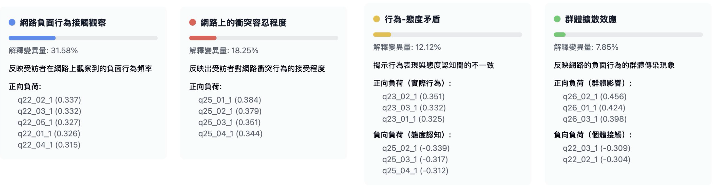

依據Kaiser準則（特徵值大於1）和陡坡圖分析，我們萃取出四個主要成分，累積解釋變異量達到69.79%。這四個主成分分別反映了不同面向的網路行為特徵：

#### 第一主成分：網路負面行為接觸觀察（解釋31.58%變異量）
這個主成分主要反映受訪者在網路上觀察到的負面行為頻率，具體表現為：
- q22_02_1（0.337）：觀察到他人責罵或攻擊行為的頻率
- q22_03_1（0.332）：觀察到針對特定對象的攻擊行為頻率
- q22_05_1（0.327）：觀察到諷刺性回覆的頻率
- q22_01_1（0.326）：觀察到不當言語的頻率
- q22_04_1（0.315）：觀察到不雅玩笑的頻率

這些負荷量相近的變數說明，這些負面行為常常同時出現，形成一種集群效應。

#### 第二主成分：網路衝突容忍程度（解釋18.25%變異量）
此主成分由q25系列題目構成，反映出受訪者對網路衝突行為的接受程度：
- q25_01_1（0.384）：對意見不同時使用挑釁話語的接受度
- q25_02_1（0.379）：在政治話題討論中使用挑釁語言的接受度
- q25_03_1（0.351）：對罵人行為的接受度
- q25_04_1（0.344）：對意見衝突時的言語攻擊接受度

這個維度顯示了使用者對網路衝突的心理承受度，高分代表較能容忍或接受對抗性的網路互動。

#### 第三主成分：行為-態度矛盾（解釋12.12%變異量）
這個主成分揭示了行為表現與態度認知間的不一致性：

正向負荷（實際行為）：
- q23_02_1（0.351）：實際對他人發怒的頻率
- q23_03_1（0.332）：實際謾罵他人的頻率
- q23_01_1（0.325）：使用不當言語的頻率

負向負荷（態度認知）：
- q25_02_1（-0.339）：政治話題挑釁的接受度
- q25_03_1（-0.317）：罵人行為的接受度
- q25_04_1（-0.312）：言語攻擊的接受度

這種對立的結構反映了社會期許效應，顯示受訪者可能在認知上反對網路暴力，但在實際互動中仍會展現攻擊性行為。

#### 第四主成分：群體擴散效應（解釋7.85%變異量）
此主成分反映網路負面行為的群體傳染現象：

正向負荷（群體影響）：
- q26_02_1（0.456）：負面行為的群體擴散程度
- q26_01_1（0.424）：負面行為的模仿效應
- q26_03_1（0.398）：負面行為的連鎖反應

負向負荷（個體接觸）：
- q22_03_1（-0.309）：個人觀察到的攻擊行為
- q22_02_1（-0.304）：個人觀察到的責罵行為

這個主成分具有特殊的理論意涵，說明網路上的負面行為不僅是個人行為，更可能透過群體動力產生擴散效應。

### 典型相關分析結果
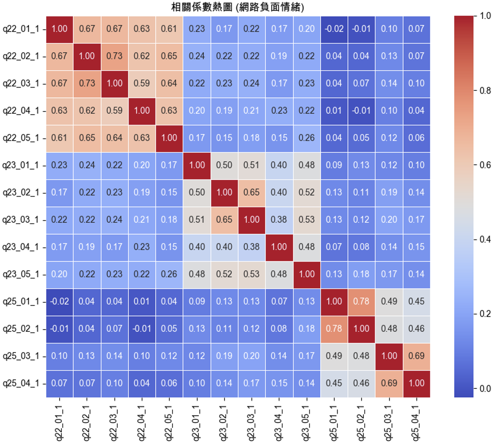

相關係數熱度圖呈現出變數間的複雜關聯模式。分析顯示三個明顯的相關群聚：

1. 第一個群聚（q22_01_1到q22_05_1）：
   - 相關係數介於0.59至0.73之間
   - 反映網路使用者觀察到的負面言論行為具有高度一致性
   - 表明這些行為常常同時出現

2. 第二個群聚（q23_01_1到q23_05_1）：
   - 相關係數約在0.38至0.65之間
   - 顯示個人實際參與網路負面行為的中度相關性
   - 暗示這些行為可能有共同的觸發機制

3. 第三個群聚（q25_01_1到q25_04_1）：
   - 相關係數達0.45至0.78
   - 表明對網路負面行為的接受度具有較強的內部一致性
   - 反映出個人態度傾向的穩定性

#### 典型相關的深入分析
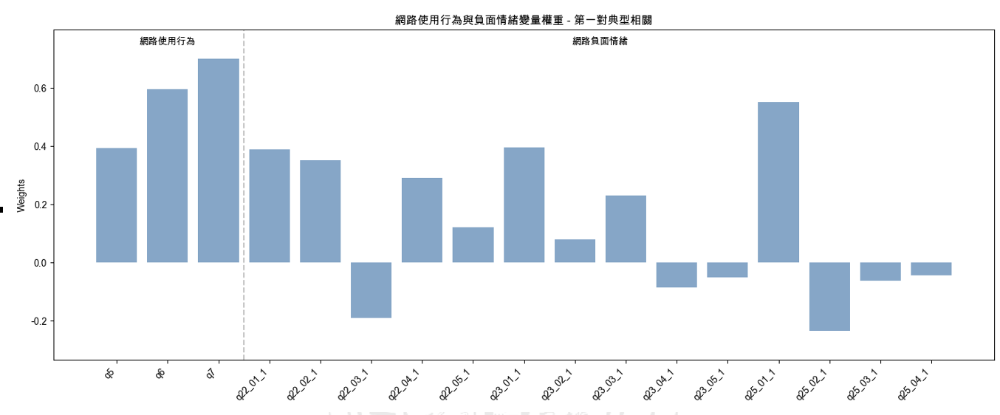
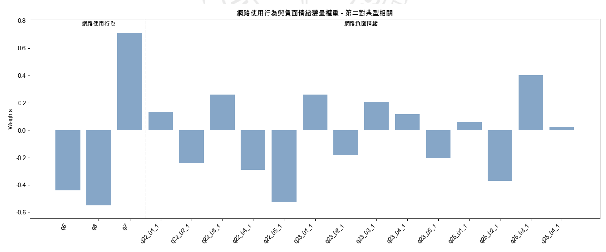

第一對典型相關分析揭示：
- 休閒娛樂上網時間（0.7003）展現最高正向權重
- 課業或工作上網時間（0.5956）次之
- 這表明網路使用目的比使用頻率（0.3936）更能預測負面行為傾向

第二對典型相關呈現不同的模式：
- 休閒娛樂上網時間維持高度正向權重（0.7122）
- 課業或工作上網時間轉為負向權重（-0.5457）
- 顯示不同性質的網路使用可能產生相反的影響

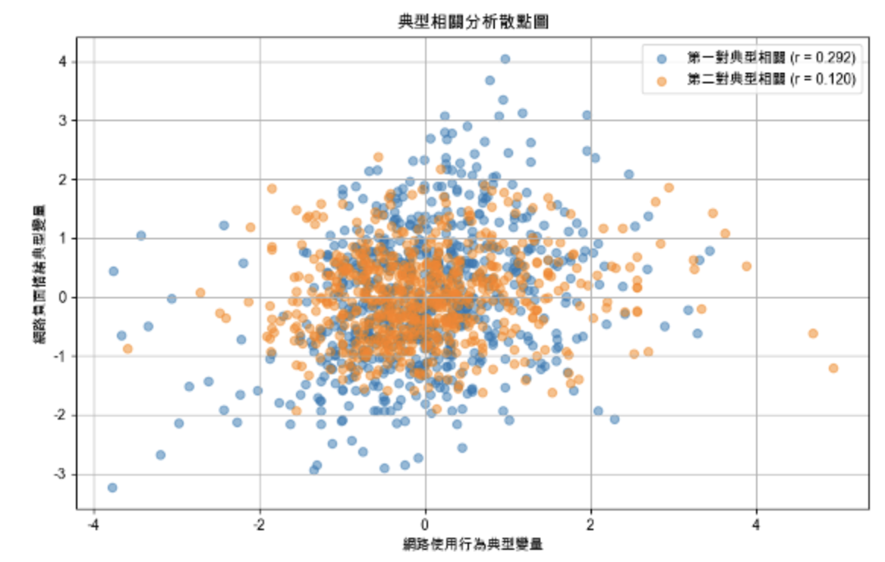

典型相關散佈圖顯示：
- 第一典型相關係數（r = 0.292）展現較明顯的正向線性趨勢
- 第二典型相關係數（r = 0.120）的分布較為集中
- 散點分布模式暗示網路使用行為與負面情緒之間存在複雜的非線性關係
- 這種關係可能受到多個中介變數的影響

這些發現為理解網路行為形成機制提供了重要的實證基礎，也為後續的干預策略設計提供了具體方向。特別是在識別高風險群體和預防負面行為擴散方面，這些分析結果具有重要的參考價值。

# 研究意義與未來展望

## 研究意義

### 理論層面的貢獻

本研究在網路行為理論建構方面提供了重要的創新和突破。首先，透過多變量分析方法的整合應用，成功建立了一個更為完整的網路行為分析框架。特別是在GAP分析中識別出的五種使用者群體，不僅補充了既有文獻對網路使用者分類的不足，更為理解網路行為的形成機制提供了新的理論視角。

研究發現的四個主要因素（網路行為規範認知、霸凌行為表現、負面影響認知和衝突容忍度）豐富了網路霸凌行為的理論構面。特別是衝突容忍度這一新發現的因素，揭示了個人特質在網路行為形成過程中的重要作用，這是過往研究較少關注的面向。

此外，本研究通過典型相關分析發現的「使用目的」與「負面行為」之間的關聯模式，挑戰了既有研究中單純將網路使用時間視為預測變數的觀點。這個發現為理解網路行為的形成機制提供了更細緻的理論基礎。

### 研究方法的創新

在研究方法論層面，本研究具有顯著的創新性。首次將廣義關聯圖（GAP）分析應用於網路行為研究領域，展現出這種方法在處理高維度社會行為數據時的獨特優勢。研究設計中結合了五種多變量分析方法，形成了一個從探索到預測的完整分析鏈，這種方法論的創新為未來相關研究提供了重要的參考範式。

### 實務應用價值

在實務應用層面，本研究的發現具有重要的政策意涵和實踐價值。首先，通過識別不同風險群體的特徵，為網路素養教育的差異化設計提供了實證基礎。例如，研究發現的風險警示群體特徵，可以直接用於建立早期預警機制，幫助教育工作者及早識別潛在的高風險使用者。

研究結果也為數位素養教育提供了具體的課程設計方向。例如，研究發現的行為-態度矛盾現象，提醒我們在教育介入時需要同時關注認知建立和行為改變。而群體擴散效應的發現，則提示我們在設計預防策略時必須考慮群體動力的影響。

### 社會政策意涵

從社會政策層面來看，本研究的發現對於制定網路治理政策具有重要的參考價值。研究指出了不同世代、性別和地區的網路使用特徵差異，這些發現可以幫助政策制定者設計更有針對性的干預措施。特別是在都會區與非都會區的差異發現，提醒我們在推動數位政策時需要考慮區域發展的不平衡性。

## 未來研究展望

### 研究方法的擴展建議

未來研究可以在本研究的基礎上，朝向更多元和深入的方向發展。首先，建議採用縱貫性研究設計，通過長期追蹤來觀察網路行為的動態變化。這種研究設計不僅能夠更好地理解行為改變的軌跡，也能提供更強的因果關係證據。

在數據收集方面，建議整合多元的數據來源。除了問卷調查外，可以考慮結合社群媒體數據分析、網路行為日誌等大數據來源，以獲得更全面和客觀的行為觀察。特別是在新興社群平台的使用行為研究方面，這種多元數據的整合顯得尤為重要。

### 理論發展方向

在理論建構方面，未來研究可以進一步探索數位科技發展對網路行為模式的影響。特別是在後疫情時代，遠距工作和數位學習的普及可能帶來新的行為模式和社會互動形式，這些都是值得深入研究的方向。

建議未來研究更深入探討文化因素在網路行為形成中的作用。可以進行跨文化比較研究，探討不同文化背景下網路使用行為的差異，以建立更具普遍性的理論框架。

### 應用研究發展

在應用研究方面，建議開發更精確的預測模型和防治工具。可以考慮運用機器學習技術，建立更準確的網路霸凌行為預警系統。同時，也可以探索運用人工智慧技術進行即時的網路言論監測和分析。

### 新興研究議題

隨著元宇宙（Metaverse）等新興科技的發展，未來研究需要關注虛擬實境環境中的社交行為模式。這包括探討沉浸式體驗對使用者行為的影響、虛擬身份認同對社交互動的影響等新議題。

同時，建議未來研究更多關注積極面向的網路使用行為。例如，探討如何促進正向的網路互動、建立健康的網路社群文化，以及培養數位公民意識等議題。這些研究不僅能夠幫助我們更好地理解網路行為，也能為建構更健康的網路環境提供重要的指引。
